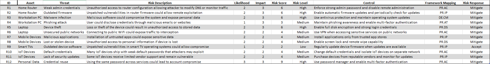

# Home Network Security Risk Assessment & Hardening Report

## Overview

This project is a practical cybersecurity risk assessment of a home network. The goal was to identify common risks, understand how they could impact a typical environment, and recommend realistic ways to reduce those risks.

## Risk Register

I built a structured risk register that includes:

* Assets in the environment
* Relevant threats
* Likelihood and impact scoring
* Overall risk levels
* Recommended controls

## How Risk Was Scored

Each risk was scored using a simple model:

Risk Score = Likelihood × Impact

* Likelihood: 1 (Low) to 3 (High)
* Impact: 1 (Low) to 3 (High)

This helped prioritize which risks needed the most attention.

## Framework Alignment

The recommended controls were mapped to the NIST Cybersecurity Framework (CSF), including areas like:

* PR.AC (Access Control)
* PR.IP (Information Protection)
* DE.CM (Continuous Monitoring)
* PR.AT (Awareness Training)

## Key Risks Identified

Some of the more important risks included:

* Reusing passwords across accounts
* Weak or default router credentials
* Outdated router firmware
* Malware risks on endpoint devices
* Device loss or theft

## Skills Demonstrated

* Risk identification and analysis
* Threat evaluation
* Risk scoring and prioritization
* Security control recommendations
* NIST CSF mapping
* GRC fundamentals

## Project Structure

* /risk_register – Full Excel risk register
* /visuals – Screenshots and visuals
* /report – [Full written assessment](report/home_network_risk_assessment.pdf)

## Purpose

This project is part of my cybersecurity portfolio focused on Governance, Risk, and Compliance (GRC). The goal is to show how I approach risk assessment in a structured and practical way.

