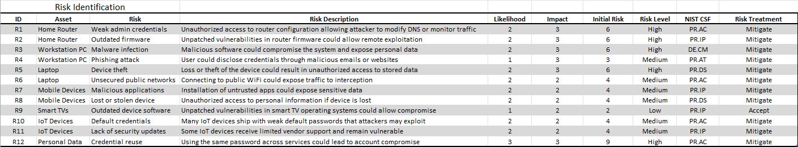
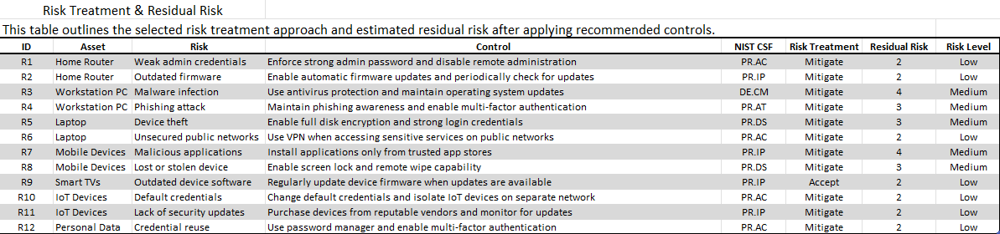

# Home Network Security Risk Assessment & Hardening Report

## Overview

This project is a hands-on cybersecurity risk assessment of a home network. The goal was to identify common risks, understand how they could impact a typical environment, and figure out realistic ways to reduce them.

---

## Risk Identification

I built a structured risk register that includes:

* Assets in the environment  
* Relevant threats  
* Likelihood and impact scoring  
* Initial risk levels  

---

## Risk Treatment & Residual Risk

After identifying the risks, I defined how each one should be handled (mostly mitigation, with a few accepted risks) and mapped them to practical controls.

I also estimated residual risk to show how much each issue improves after applying those controls.

---

## How Risk Was Scored

Each risk was scored using a simple model:

Risk Score = Likelihood × Impact

* Likelihood: 1 (Low) to 3 (High)  
* Impact: 1 (Low) to 3 (High)  

Residual risk was estimated based on how each control would realistically reduce likelihood, impact, or both.

---

## Framework Alignment

The recommended controls were mapped to the NIST Cybersecurity Framework (CSF), including:

* PR.AC (Access Control)  
* PR.IP (Information Protection)  
* DE.CM (Continuous Monitoring)  
* PR.AT (Awareness Training)  

---

## Key Risks Identified

Some of the more important risks included:

* Reusing passwords across accounts  
* Weak or default router credentials  
* Outdated router firmware  
* Malware risks on endpoint devices  
* Device loss or theft  

---

## Results & Impact

Applying the recommended controls noticeably reduced overall risk across the environment.

* High-risk items were brought down to Medium or Low  
* Credential-related risks (like password reuse and weak credentials) improved the most  
* Network risks (public WiFi exposure, IoT devices) were reduced with simple changes like segmentation and VPN use  
* Most remaining risks are now Low or Medium and are reasonable for a typical home setup  

Overall, this shows how practical, low-effort changes can make a meaningful difference without needing enterprise-level tools.

---

## Skills Demonstrated

* Risk identification and analysis  
* Risk treatment and decision-making  
* Residual risk evaluation  
* Security control recommendations  
* NIST CSF mapping  
* GRC fundamentals  

---

## Project Structure

* /risk_register – Full Excel risk register  
* /visuals – Screenshots and visuals  
* /report – [Full written assessment](report/home_network_risk_assessment.pdf)  

---

## Purpose

This project is part of my cybersecurity portfolio focused on Governance, Risk, and Compliance (GRC). It shows how I approach risk from start to finish — identifying issues, deciding how to handle them, and reducing them in a practical way.
